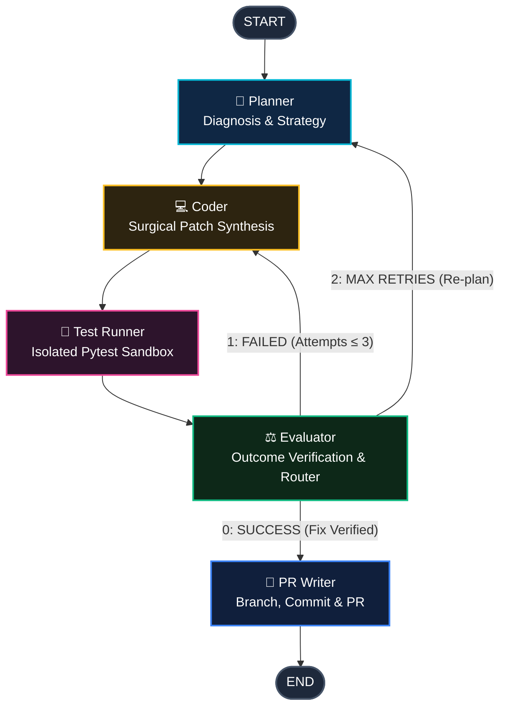

# Bug Solver Agent

<div align="center">


<p align="center">
  <strong>An autonomous, cyclical SWE-bench style bug resolution agent powered by LangGraph.</strong><br>
  Diagnoses repository issues, synthesizes surgical code patches, executes isolated test sandboxes, evaluates results with retry loops, and automatically opens Pull Requests.
</p>

</div>

---

## Highlights & Capabilities

- 🧠 **5-Node Cyclical LangGraph Architecture**: Planner ➔ Coder ➔ Test Runner ➔ Evaluator ➔ PR Writer with self-correcting feedback loops.
- ⚡ **Multi-Provider LLM Engine**: Seamlessly switch between **Ollama** (offline/local, no API keys), **Anthropic Claude 3.5**, **OpenAI GPT-4o**, **Groq**, and **OpenRouter**.
- 🖥️ **Live Terminal Observability**: Real-time Rich console streaming with colored node steps, syntax-highlighted git diffs, and execution outcome tables.
- 🌐 **Interactive Web DAG Visualizer**: Built-in glassmorphism web UI (`bugsolver ui`) featuring animated stateflow simulation and JSON schema export.
- 🩹 **Surgical Code Editing (`patch_file`)**: Eliminates full-file hallucinations with precision search-and-replace patching.
- 🛡️ **Subprocess Sandbox & Git Isolation**: Enforces repository-scoped execution, sanitizer guards against command injection, and creates isolated fix branches.
- 📊 **Turnkey Benchmarks**: Reproducible SWE fixtures (`null_guard`, `off_by_one`, `missing_key`) with automated scorecard generation.

---

## Architecture Flow



---

## Quickstart & Installation

### 1. Installation

```bash
# Clone the repository
git clone https://github.com/sawyer-anderson1/bug-solver.git
cd bug-solver

# Install in editable mode
pip install -e .
```

### 2. Configure Your LLM Provider

Bug Solver runs natively on local Ollama models (default) or cloud API providers:

```bash
# Option A: Local Ollama (Zero API Keys)
ollama pull qwen2.5-coder:7b

# Option B: Cloud Providers (Set environment variables)
export ANTHROPIC_API_KEY="sk-ant-..."
export OPENAI_API_KEY="sk-..."
export GROQ_API_KEY="gsk_..."
export OPENROUTER_API_KEY="sk-or-..."

# Optional: For GitHub issue import & automated PR creation
export GITHUB_TOKEN="ghp_..."
```

---

## CLI Usage

### Autonomous Bug Fixing (`bugsolver run`)

```bash
# Mode 1: Fix a local bug using local Ollama model
bugsolver run "Fix NoneType crash in calculator.py" --local-only

# Mode 2: Fix with Claude 3.5 Sonnet on Anthropic
bugsolver run "Fix pagination off-by-one" --provider anthropic --model claude-3-5-sonnet-latest --local-only

# Mode 3: Fix with OpenAI GPT-4o
bugsolver run "Resolve database config missing key" --provider openai --model gpt-4o --local-only

# Mode 4: Remote GitHub Issue -> Automated Branch & Pull Request
bugsolver run 142 --name owner/repo --pr
```

### Interactive Web DAG Visualizer (`bugsolver ui`)

Launch the visualizer to explore graph state channels, inspect node prompts, and simulate live repair loops:

```bash
bugsolver ui
# Automatically opens http://127.0.0.1:8765/
```

Options:
- `--port / -p`: Custom port (default: `8765`)
- `--no-open`: Run server without opening the browser

---

## Reproducible SWE Benchmark Suite

Bug Solver includes a reproducible evaluation harness with 3 self-contained buggy repositories under `benchmarks/fixtures/`:

| Benchmark Task | Fixture Path | Bug Description | Expected Fix |
|---|---|---|---|
| `null-guard-calculator` | `benchmarks/fixtures/null_guard` | `parse_and_sum()` crashes on `None` | Ignore `None` and sum valid integers |
| `off-by-one-paginator` | `benchmarks/fixtures/off_by_one` | 1-indexed page arithmetic off by one | Correct slice bounds `(page - 1) * page_size` |
| `missing-key-config-loader` | `benchmarks/fixtures/missing_key` | `KeyError` when port is omitted | Provide fallback default port `5432` |

### Running the Benchmark

```bash
# Prepare fixtures (if not already initialized)
python benchmarks/setup_fixtures.py

# Execute the benchmark suite
python benchmarks/run_benchmark.py benchmarks/tasks.json --output benchmarks/results/
```

Generates `benchmarks/results/results.json` and a Markdown scorecard `benchmarks/results/scorecard.md`.

---

## Production Verification & Test Suite

All adapters, graph routing logic, filesystem tools, and utilities are strictly verified with 36 unit & integration tests:

```bash
# Run complete test suite
python -m pytest

# Run linter checks (0 errors)
ruff check .
```

```
collected 36 items

tests/integration_tests/test_graph.py ..                  [  5%]
tests/unit_tests/test_benchmarks.py ..                    [ 11%]
tests/unit_tests/test_check_status.py ....                [ 22%]
tests/unit_tests/test_configuration.py ...                [ 30%]
tests/unit_tests/test_filesystem_adapter.py .             [ 33%]
tests/unit_tests/test_git_adapter.py .                    [ 36%]
tests/unit_tests/test_github_adapter.py .                 [ 38%]
tests/unit_tests/test_json_parser.py ....                 [ 50%]
tests/unit_tests/test_model_factory.py ...                [ 58%]
tests/unit_tests/test_patch_file.py ....                  [ 69%]
tests/unit_tests/test_pytest_sanitize.py .....            [ 83%]
tests/unit_tests/test_testing_tools.py .....              [ 97%]
tests/unit_tests/test_ui.py .                             [100%]

======================== 36 passed in 29.22s =========================
```

---

## Repository Structure

```
bug-solver/
├── src/
│   ├── agent/                  # LangGraph cyclical state machine
│   │   ├── graph.py            # StateGraph definition & conditional check_status router
│   │   ├── nodes.py            # Planner, Coder, Test Runner, Evaluator, PR Writer
│   │   └── state.py            # TypedDict state channels
│   ├── adapters/               # Pluggable concrete drivers
│   │   ├── filesystem/         # PATHLIBPythonManager & OSPythonManager with patch_file
│   │   ├── git/                # SubprocessGitManager with cwd isolation & command sanitization
│   │   ├── platform/           # PyGithubManager for GitHub issues & PRs
│   │   └── testing/            # SubprocessPytestManager sandbox
│   ├── tools/                  # LangChain tool factories over adapters
│   ├── skills/                 # Markdown system prompts and response templates
│   ├── utils/                  # Multi-provider model factory, JSON regex parser, Rich UI
│   ├── web/                    # Glassmorphism Web DAG & Stateflow visualizer
│   ├── cli.py                  # Typer CLI with 'run' and 'ui' commands
│   └── constants.py            # MAX_RETRIES and Status enum
├── benchmarks/                 # SWE-bench style benchmark runner & fixture repos
├── tests/                      # 36 unit & integration test suites
├── pyproject.toml              # Modern setuptools packaging & dependencies
└── Dockerfile                  # Containerized sandbox environment
```

---

## Attribution & License

- Original architectural concept & scaffolding by [Sawyer Anderson](https://github.com/sawyer-anderson1/bug-solver) (MIT).
- Hardened, expanded, and productionized with multi-provider LLM support, interactive Web DAG visualizer, surgical patching, and SWE test harnesses.
- Licensed under the [MIT License](LICENSE).
