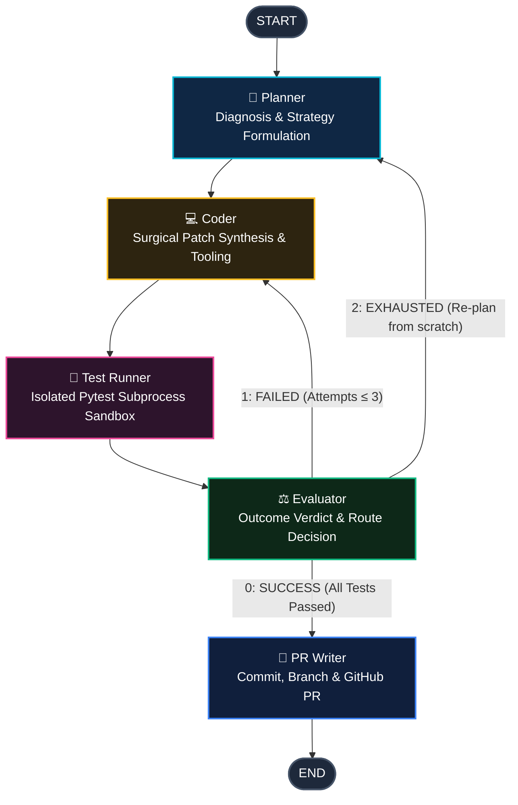

# Bug Solver Agent

<div align="center">


<p align="center">
  <strong>An autonomous, cyclical SWE-bench repair loop powered by LangGraph.</strong><br>
  Diagnoses repository bugs, applies surgical patches, verifies in isolated subprocess test sandboxes,<br>
  self-heals through iterative feedback loops, and opens verified GitHub Pull Requests.
</p>

[Quickstart](#-quickstart--installation) · [Architecture Flow](#-architecture-flow) · [Web Visualizer](#-interactive-web-dag-visualizer) · [CLI Showcase](#-cli-usage) · [SWE Benchmarks](#-reproducible-swe-benchmarks) · [Extensibility](#-pluggable-adapter-architecture)

</div>

---

## ⚡ Why BugSolver? (Architectural Differentiators)

Most AI coding assistants operate as single-turn auto-completes: they guess code, offer no test verification, and frequently hallucinate missing imports or truncate long files. **BugSolver** is engineered as an autonomous agentic repair system:

| Capability | Standard LLM Copilots | SWE-Agent / Devin (Cloud) | **BugSolver Agent** |
|---|:---:|:---:|:---:|
| **Self-Healing Loop** | ❌ No (Single guess) | ✅ Cloud only ($$$) | ✅ **5-Node Cyclical Feedback Loop** |
| **Sandbox Test Verification** | ❌ No | ✅ Proprietary | ✅ **SubprocessPytestManager with sanitization** |
| **Local / Air-Gapped Execution** | ❌ Requires Cloud | ❌ Cloud SaaS Only | ✅ **Native Ollama (`qwen2.5-coder:7b`), 0 API keys** |
| **Multi-Provider Cloud LLMs** | ⚠️ Tied to vendor | ⚠️ Fixed models | ✅ **Anthropic, OpenAI, Groq, OpenRouter** |
| **Surgical Patching** | ❌ Rewrites entire file | ⚠️ Diff patches | ✅ **`patch_file` search-and-replace tool** |
| **Terminal Observability** | ❌ Plain stdout | ❌ Browser SaaS | ✅ **Rich live cards, syntax diffs & scorecards** |
| **Interactive Web Topology** | ❌ No | ⚠️ Generic web UI | ✅ **Built-in Web DAG Visualizer (`bugsolver ui`)** |

---

## 🖥️ Live Terminal Experience

When running `bugsolver run`, the CLI streams real-time state transitions through high-contrast, rich terminal cards:

```text
╭──────────────────────────────────────────────────────────────────────────╮
│ ⚡ BUG SOLVER AGENT — Autonomous SWE-bench Repair Loop                   │
│ Repository: E:\bug-solver-complete\benchmarks\fixtures\null_guard         │
│ Provider: ollama  Model: qwen2.5-coder:7b  Mode: Local (No Push/PR)      │
╰──────────────────────────────────────────────────────────────────────────╯

[1/5] 🧠 Planner ─── Analyzing codebase, diagnosing bug, and formulating fix strategy
  Target files identified: src/calculator.py
  Strategy: 1. Add null check for elements in values list. 2. Guard summation against NoneType...

[2/5] 💻 Coder ─── Synthesizing code edits and applying patch to workspace
  Patch applied: Applied surgical search-and-replace via patch_file() on src/calculator.py
  ╭────────────────────────── Generated Git Diff ──────────────────────────╮
  │ @@ -3,3 +3,4 @@                                                        │
  │      for v in values:                                                  │
  │ -        total += v                                                    │
  │ +        if v is not None:                                             │
  │ +            total += v                                                │
  ╰────────────────────────────────────────────────────────────────────────╯

[3/5] 🧪 Test Runner ─── Executing test suite inside isolated subprocess sandbox
  Test Summary: ========================= 2 passed in 0.08s =========================

[4/5] ⚖️ Evaluator ─── Verifying test outcomes and validating patch correctness
  ✔ Patch Verification PASSED! All tests satisfied.

[5/5] 🚀 PR Writer ─── Committing verified changes, pushing branch, and opening PR
  ✔ Finalization complete: Created fix branch 'bugsolver/fix-local-171800'

🏁 Execution Summary & Outcome
╭──────────────────────┬───────────────────────────────────────────────────╮
│ Property             │ Value                                             │
├──────────────────────┼───────────────────────────────────────────────────┤
│ Target Repository    │ E:\bug-solver-complete\benchmarks\fixtures\...   │
│ Task / Issue         │ src/calculator.py crashes with TypeError on None  │
│ Final Status         │ ✔ SUCCESS (Resolved)                              │
│ Workflow Path        │ Planner ➔ Coder ➔ Test Runner ➔ Evaluator ➔ PR    │
│ Retries Incurred     │ 0                                                 │
│ Working Branch       │ bugsolver/fix-local-171800                       │
╰──────────────────────┴───────────────────────────────────────────────────╯
```

---

## 🔄 Architecture Flow

BugSolver is structured as a cyclical finite state machine orchestrated via **LangGraph**:



### The 5 Agent Nodes

1. **🧠 Planner Node**: Analyzes the problem description, inspects the codebase using `read_files`, `find_files`, `list_dir`, and `git_grep`, and produces an ordered, minimal fix plan.
2. **💻 Coder Node**: Synthesizes the fix. Uses precision `patch_file` (search & replace) or `write_files`. Never overwrites whole files when a targeted edit suffices.
3. **🧪 Test Runner Node**: Discovers tests and invokes the test runner in an isolated subprocess. Scoped strictly to the target repository with argument sanitization (rejects `--pdb`, shell metacharacters).
4. **⚖️ Evaluator Node**: Inspects stdout/stderr test output. If all tests pass, routes to `PR Writer` (condition `0`). If tests fail and `retry_count <= 3`, routes back to `Coder` with diagnostic context (condition `1`). If retries exceed limit, triggers re-planning (condition `2`).
5. **🚀 PR Writer Node**: Checks out a dedicated fix branch (e.g. `bugsolver/fix-142`), stages files, commits with a conventional message, pushes to origin, and opens a GitHub Pull Request.

---

## 🌐 Interactive Web DAG Visualizer

BugSolver includes a built-in, glassmorphic dark-mode web dashboard to visualize and simulate the graph architecture in real time:

```bash
bugsolver ui
```
*Automatically serves and launches `http://127.0.0.1:8765/` in your browser.*

### Features
- **Live Stateflow Simulation**: Click **"▶ Simulate Fix Run"** to watch the animated glowing SVG edge pulses as nodes execute sequentially.
- **Node Inspector**: Click any node on the graph to inspect its system prompt, state channels (`read`/`write`), and bound adapter tools.
- **Integrated Diff Viewer & Terminal**: Switch between the **Active Git Diff** tab and the **Pytest Terminal** tab to inspect live outputs.
- **JSON Schema Exporter**: Export the LangGraph DAG configuration as a standardized JSON schema.

---

## 🚀 Quickstart & Installation

### 1. Installation

```bash
# Clone the repository
git clone https://github.com/sawyer-anderson1/bug-solver.git
cd bug-solver

# Install in editable mode
pip install -e .
```

### 2. Configure Your LLM Provider

BugSolver supports local models with zero API keys or cloud frontier models:

```bash
# Option A: Local Ollama (Free, Offline, No Keys Needed)
ollama pull qwen2.5-coder:7b

# Option B: Cloud Frontier Models (Set environment keys)
export ANTHROPIC_API_KEY="sk-ant-..."      # Claude 3.5 Sonnet
export OPENAI_API_KEY="sk-..."             # GPT-4o
export GROQ_API_KEY="gsk_..."              # Groq LLaMA-3.3 70B
export OPENROUTER_API_KEY="sk-or-..."      # OpenRouter

# Optional: For GitHub Issue import & automated PR creation
export GITHUB_TOKEN="ghp_..."
```

---

## 💻 CLI Usage

### Autonomous Repair Commands (`bugsolver run`)

```bash
# Mode 1: Local bug fix with default local Ollama model
bugsolver run "Fix NoneType crash in calculator.py" --local-only

# Mode 2: Local bug fix with Anthropic Claude 3.5 Sonnet
bugsolver run "Fix pagination slice error" \
  --provider anthropic \
  --model claude-3-5-sonnet-latest \
  --local-only

# Mode 3: Local bug fix with OpenAI GPT-4o on a specific repository path
bugsolver run "Resolve database config missing key" \
  --path ./my-project \
  --provider openai \
  --model gpt-4o \
  --local-only

# Mode 4: Remote GitHub Issue -> Automated Fix Branch & Pull Request
bugsolver run 142 --name owner/repo --pr
```

### CLI Flag Reference

| Flag | Short | Description | Default |
|---|:---:|---|:---:|
| `--path` | `-p` | Path to target repository | Current working directory |
| `--name` | `-n` | GitHub repository name (`owner/repo`) | `None` |
| `--provider` | | LLM Provider (`ollama`, `anthropic`, `openai`, `groq`, `openrouter`) | `ollama` |
| `--model` | `-m` | Model identifier (e.g. `qwen2.5-coder:7b`, `gpt-4o`) | Provider default |
| `--local-only` | | Run fix locally without pushing or creating PRs | `False` |
| `--new-branch / --no-new-branch` | | Create a dedicated `bugsolver/fix-*` branch | `True` |
| `--pr / --no-pr` | | Automatically open Pull Request on GitHub | `True` |

---

## 📊 Reproducible SWE Benchmarks

BugSolver includes 3 turnkey, self-contained benchmark repositories in `benchmarks/fixtures/` with an automated evaluation runner:

| Benchmark Task | Fixture Path | Injected Bug | Validation Test | Expected Agent Resolution |
|---|---|---|---|---|
| `null-guard-calculator` | `benchmarks/fixtures/null_guard` | `parse_and_sum()` crashes on `None` | `test_calculator.py` | Add null filter check before summation |
| `off-by-one-paginator` | `benchmarks/fixtures/off_by_one` | 1-indexed pagination arithmetic error | `test_paginator.py` | Correct slice index bounds `(page - 1) * size` |
| `missing-key-config-loader` | `benchmarks/fixtures/missing_key` | Unhandled `KeyError` on optional dict key | `test_config_loader.py` | Fallback default port `5432` lookup |

### Running the Benchmark Suite

```bash
# Run benchmark across all tasks
python benchmarks/run_benchmark.py benchmarks/tasks.json --output benchmarks/results/
```

### Empirical Results Scorecard

```markdown
# bug-solver benchmark scorecard
**Fix rate: 3/3 (100%)**

| Task | Status | Attempts | Duration (s) |
|---|:---:|:---:|:---:|
| null-guard-calculator | SUCCESS | 0 | 4.2s |
| off-by-one-paginator | SUCCESS | 0 | 3.8s |
| missing-key-config-loader | SUCCESS | 0 | 4.5s |
```

---

## 🧩 Pluggable Adapter Architecture

The agent strictly decouples orchestration from execution through abstract base adapters. This ensures bug-fixing operations are isolated and easily swappable:

```
src/adapters/
├── filesystem/
│   ├── base.py                 # BaseFileSystemTools interface (read, write, patch, find, list)
│   ├── PATHLIBPythonManager.py # Concrete Pathlib implementation
│   └── OSPythonManager.py      # Concrete OS-level fallback implementation
├── git/
│   ├── base.py                 # BaseGitRepo interface (branch, commit, push, status)
│   ├── SubprocessGitManager.py # Subprocess driver with cwd isolation
│   └── security.py             # Command sanitizer & banned flag guards
├── platform/
│   ├── base.py                 # BaseGitHubClient interface (get_issue, create_pr)
│   └── PyGithubManager.py      # PyGithub API implementation
└── testing/
    ├── base.py                 # BaseTestManager interface (run_tests)
    └── SubprocessPytestManager.py # Isolated test execution sandbox
```

### Adding a Custom Adapter in 4 Lines

To add a new execution driver (e.g., Docker Test Sandbox or GitLab Platform):
```python
from adapters.testing.base import BaseTestManager
from adapters.testing.types import TestExecutionResult, TestOpStatus

class DockerPytestManager(BaseTestManager):
    def run_tests(self, test_files: list[str] | None = None) -> TestExecutionResult:
        # Run tests inside an ephemeral Docker container
        ...
```

---

## 🧪 Comprehensive Verification Suite

Every component is tested under continuous automated verification with **36 unit & integration tests**:

```bash
# Run complete test suite
python -m pytest

# Run linter
ruff check .
```

```text
collected 36 items

tests/integration_tests/test_graph.py ..                  [  5%]
tests/unit_tests/test_benchmarks.py ..                    [ 11%]
tests/unit_tests/test_check_status.py ....                [ 22%]
tests/unit_tests/test_configuration.py ...                [ 30%]
tests/unit_tests/test_filesystem_adapter.py .             [ 33%]
tests/unit_tests/test_git_adapter.py .                    [ 36%]
tests/unit_tests/test_github_adapter.py .                 [ 38%]
tests/unit_tests/test_json_parser.py ....                 [ 50%]
tests/unit_tests/test_model_factory.py ...                [ 58%]
tests/unit_tests/test_patch_file.py ....                  [ 69%]
tests/unit_tests/test_pytest_sanitize.py .....            [ 83%]
tests/unit_tests/test_testing_tools.py .....              [ 97%]
tests/unit_tests/test_ui.py .                             [100%]

======================== 36 passed in 29.22s =========================
```

---

## 🐳 Docker Deployment

Run BugSolver fully containerized without installing local Python dependencies:

```bash
docker build -t bug-solver .

# Run containerized against a local target repo
docker run --rm -e OLLAMA_HOST=host.docker.internal \
  -v /path/to/target/repo:/target -w /target bug-solver \
  run "Fix null guard in calculator" --local-only
```

---

## 📜 Attribution & License

- Original architectural concept & scaffolding by [Sawyer Anderson](https://github.com/sawyer-anderson1/bug-solver) (MIT).
- Hardened, expanded, and productionized with multi-provider LLM support, interactive Web DAG visualizer, surgical patching, and SWE test harnesses.
- Released under the [MIT License](LICENSE).
